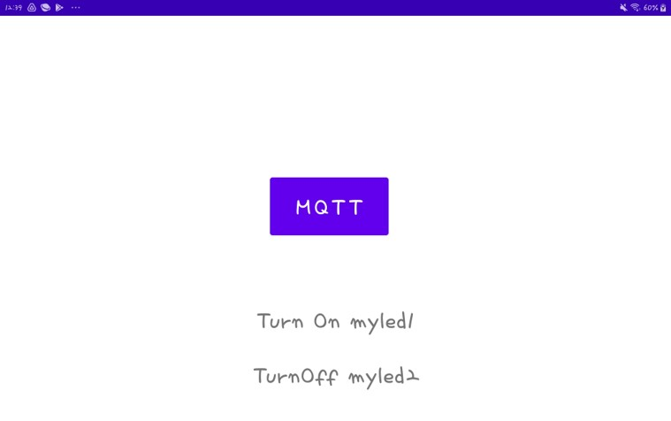
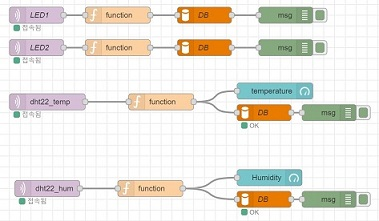
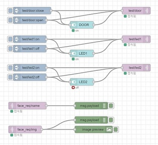
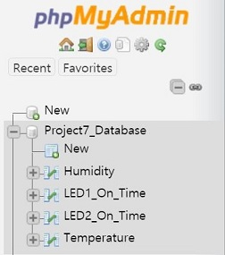
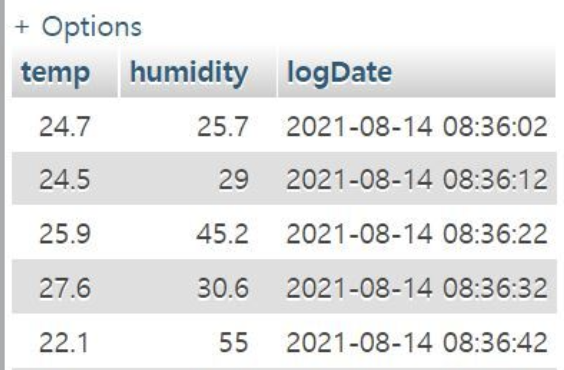

https://github.com/lhiday-purdue/Project7-Build-an-IoT-Platform-from-Scratch

Large-scale IoT is often based on cloud providers such as Amazon, Microsoft, and Google.
Though their IoT platforms include the tools to make handling the processes easier, they are often expensive and are difficult to predict the costs for a small IoT implementation.
This project will look at the IoT ecosystem and investigate building a system to handle all of the different basic IoT functions, including data storage, analytics, etc.

### Team Members
Yuting Tan - Perdue University  
Jayoung Hong - Pusan National University  
Donghyeon Lee - Pusan National University  
Eunjong Kim - Pusan National University  
Soyeon Lee - Pusan National University  
Kamila Makhmudova - Pusan National University  
 
 

# Build an IoT Platform from Scratch
 
 

## Goal of Project
Implement one's own Smart Home IoT platform, which includes Security Camera, a light system, checking temperature and humidity, controlling with the application.  
 
 

## Server
Our server is a cloud server hosted by DigitalOcean.
 
 

## Web application

 
 

## Android application

 
 

## Simple smart home

 
 

## LED system
- Since there are some problems with communicating to self-developed applications, the features that planned to be implemented by applications were implemented by the Node-RED.

 
 

## Remote door

 
 

## Face recognition

 
 

## Node-RED flows

 
 

## Database

 
 

## Future plan
We will try hard to solve the problem that we struggled now.  
If we solve the problem we can use our self-developed application.  
Furthermore, we can add more functions like data visualization or data analysis, we can add more sensors and devices as we want.  
That is the future of the IoT smart home platform that we implemented.  
 
 
