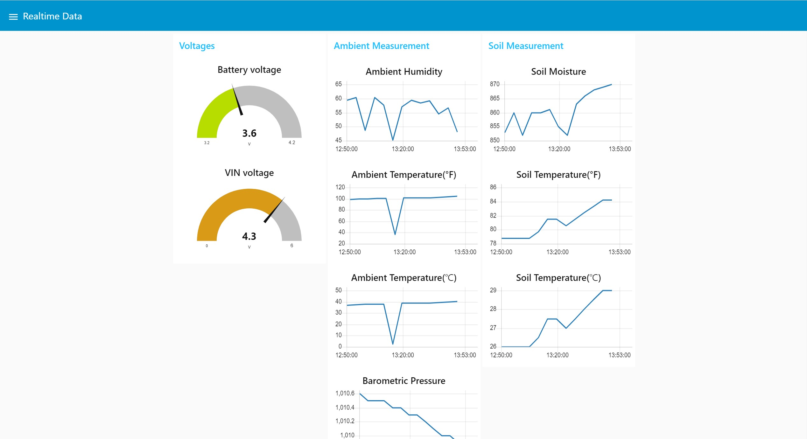
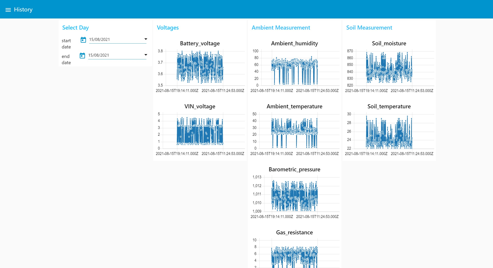
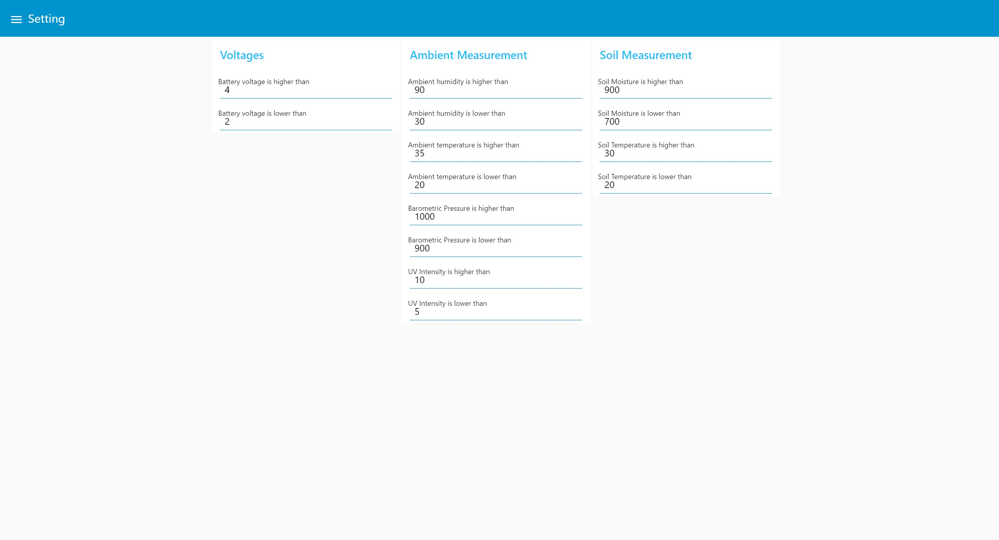

# User Interface

## Link

[http://132.145.95.163:1880/ui](http://132.145.95.163:1880/ui) 

## Tools

### The Things Network
connects weather station and Node-RED using MQTT broker. 
 
server
- nam1.cloud.thethings.industries

### Node-RED

server

- 132.145.95.163

installed

- node-red v2.0.3
- node-red-dashboard v2.30.0
- node-red-node-base64 v0.3.0
- node-red-node-email v1.12.3
- node-red-node-mysql v0.2.1

### MySQL
version
- v8.0.26

server 
- 132.145.95.163

## Major Features

### Realtime Data
Realtime Data page shows sensor data through gauge or linear graph.   

### History
History includes pages as follows.
- History : shows entire DB data
- Daily : shows daily history of weather data
- Weekly : shows weekly history of weather data
- Monthly : shows monthly history of weather data
- Yearly : shows yearly history of weather data   
 
 

### Email Notification
you can set up an email notification when weather value goes higher or lower than settings. 
now only available to testGAEUN@gmail.com   

## DB Usage

### Table Information
#### SensorData
|field name|data type|
|----------|---------|
| msgID | varchar(20) |
| time | datetime (mysql datetime, format : YYYY-MM-DD hh:mm:ss) |
| Battery_voltage | decimal(4,2) |
| VIN_voltage | decimal(4,2) |
| Ambient_temperature | decimal(4,2) |
| Ambient_humidity | decimal(4,2) |
| Barometric_pressure | decimal(6,2) |
| Gas_resistance | decimal(4,2) |
| Soil_temperature | decimal(4,2) |
| Soil_moisture | int |
| UV_intensity | decimal(4,2) |
